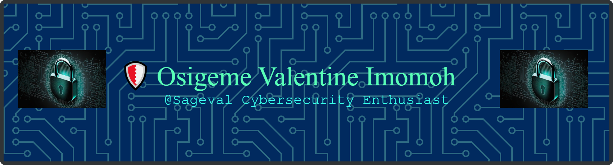

# 👋 Hi, I'm Osigbeme Valentine Imomoh

Cybersecurity Professional • ISC² Certified in Cybersecurity (CC) • Security Analyst • Instructor • Software Developer

I'm passionate about building secure systems, investigating security incidents, and developing practical cybersecurity projects that bridge theory with real-world application.

My work spans security operations, network security, Linux administration, secure software development, and AI-powered cybersecurity solutions.

## 🛡️ Areas of Expertise

- Security Operations (SOC)
- Incident Response & Threat Investigation
- Network Security & Enterprise Networking
- Linux & Windows Security
- Vulnerability Assessment
- Penetration Testing
- Secure Software Development
- AI Applications in Cybersecurity
- Technical Training & Cybersecurity Education

## 📂 Featured Projects

🔹 CareerPilot-AI

AI-powered career assistant for cybersecurity professionals.

---

🔹 Enterprise Networking Labs

Cisco Packet Tracer enterprise network simulations including VLANs, STP, ACLs and Inter-VLAN Routing.

---

🔹 Security Labs

Hands-on blue team and offensive security exercises covering Linux, Windows, networking and incident response.
- [Metasploitable2 Penetration Testing Report](https://github.com/Sageval/penetration-testing-lab): A detailed write-up of vulnerabilities exploited in a Metasploitable2 lab.
- [Active Directory Lab](https://github.com/osigbeme/ad-lab): In-progress walkthrough of privilege escalation in an AD environment.

## 💻 Technologies

### Languages
Python • Bash • PowerShell

### Operating Systems
Linux • Kali Linux • Windows

### Networking
Cisco Packet Tracer
Wireshark
Nmap

### Security Tools
Burp Suite
Metasploit
OWASP ZAP
Nikto
SQLMap
Splunk
Wazuh

### Development
Git
GitHub
Docker
VirtualBox

## 🏆 Certifications

- ISC² Certified in Cybersecurity (CC)
- Cisco Networking Academy
- TryHackMe Learning Paths
- 
## 🚀 Current Focus

- Building CareerPilot-AI
- Expanding Security Operations (SOC) skills
- Cloud Security (AWS & Azure)
- Detection Engineering
- Python Automation for Cybersecurity
- AI Security

  ## 📊 GitHub Stats

## 📫 Connect with Me
- LinkedIn: [linkedin.com/in/valentine](https://linkedin.com/in/osigbeme-imomoh)
- Github Discussions: [@CyberSense](https://x.com/cyber_sens37446)
- Youtube (Cybersecurity): [@cybersensehq](https://youtube.com/@cybersensehq?si=qdGEUHnt-oFayaf7)
- Email: [cybersensehq@gmail.com](cybersensehq@gmail.com)

---

💡 “Security is not a product, but a process.” – Bruce Schneier

