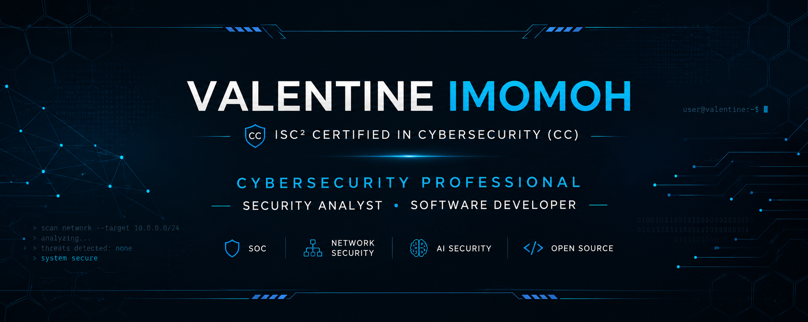

# 👋 Hi, I'm Valentine Imomoh

Cybersecurity Professional • ISC² Certified in Cybersecurity (CC) • Security Analyst • Instructor • Software Developer

I design and build intelligent systems that strengthen cybersecurity through automation, AI, education, and practical engineering.

My work spans security operations, network security, Linux administration, secure software development, and AI-powered cybersecurity solutions.

## Engineering Philosophy
I believe cybersecurity is most effective when security engineering, automation, AI, and education work together. My projects focus on building practical systems that simplify complex security problems while remaining transparent, well documented, and reproducible.

## 🛡️ Areas of Expertise

- Security Operations (SOC)
- Incident Response & Threat Investigation
- Network Security & Enterprise Networking
- Linux & Windows Security
- Vulnerability Assessment
- Penetration Testing
- Secure Software Development
- AI Applications in Cybersecurity
- Technical Training & Cybersecurity Education

## 📂 Featured Projects

🔹 CareerPilot-AI

AI-powered cybersecurity career platform that automates CV tailoring, opportunity tracking, skill-gap analysis, and career planning using local LLMs and structured knowledge systems..

---

🔹 Enterprise Networking Labs

Cisco Packet Tracer enterprise network simulations including VLANs, STP, ACLs and Inter-VLAN Routing.
- [STP Simulation](https://github.com/Sageval/STP-Enterprise-Network-Simulation)

---

🔹 Security Labs

Hands-on blue team and offensive security exercises covering Linux, Windows, networking and incident response.
- [Metasploitable2 Penetration Testing Report](https://github.com/Sageval/penetration-testing-lab): A detailed write-up of vulnerabilities exploited in a Metasploitable2 lab.
- [Active Directory Lab](https://github.com/osigbeme/ad-lab): In-progress walkthrough of privilege escalation in an AD environment.

## 💻 Technologies

### Languages
 **Python** • 
 **Bash** •  **PowerShell**

### Operating Systems
 **Linux** • 
 **Kali Linux** • 
**Windows**

### Networking
Cisco Packet Tracer • Wireshark • Nmap

### Security Tools
Burp Suite • Metasploit • OWASP ZAP • Nikto • SQLMap • Splunk • Wazuh

### Development
 **Git** • 
 **GitHub** •  **Docker** • 
**VirtualBox**

## 🏆 Certifications

- ISC² Certified in Cybersecurity (CC)
- Cisco Networking Academy
- TryHackMe Learning Paths

## 🚀 Current Focus

- Building CareerPilot-AI
- Advancing Security Operations (SOC) & Detection Engineering
- Cloud Security (AWS & Azure)
- Devsecops
- Detection Engineering
- Python Automation for Cybersecurity
- AI Security

  ## 📊 GitHub Stats

## 📫 Connect with Me
- LinkedIn: [linkedin.com/in/valentine](https://linkedin.com/in/osigbeme-imomoh)
- Youtube (Cybersecurity): [@cybersensehq](https://youtube.com/@cybersensehq?si=qdGEUHnt-oFayaf7)
- Email: [cybersensehq@gmail.com](cybersensehq@gmail.com)

---

💡 “Security is not a product, but a process.” – Bruce Schneier

